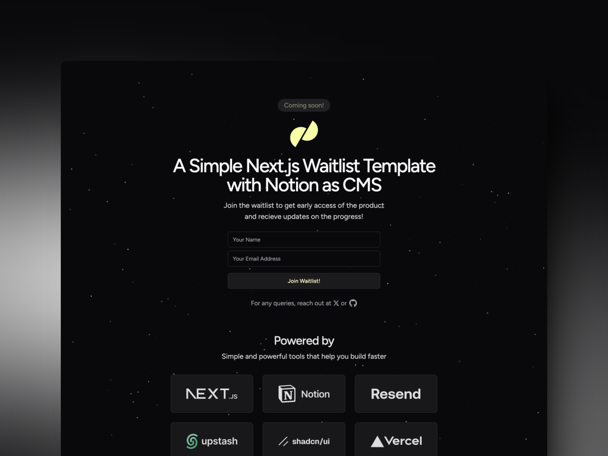

<h1 align="center">Next.js + Notion — Wailtist Template</h1>

This is a template repository for creating a waitlist using Next.js 14, Notion as a CMS, Upstash Redis for rate limiting and Resend for sending emails with a custom domain.

The UI is built using a mix of shadcn/ui, Magic UI and Tailwind CSS.

## Features

- **Next.js 14**: The most popular React framework.
- **Notion as a CMS**: Use Notion to manage your waitlist users.
- **Upstash Redis**: Use Upstash Redis to rate limit the number of signups in a given time period.
- **Resend**: Use Resend to send emails to users who sign up.
- **Vercel**: Deploy the app to Vercel with a single click.
- **shadcn/ui**: Use shadcn/ui for building the UI components.

## Why Notion?

Notion is used everywhere nowadays. It's a great tool for managing content and it's free to use. But a lot of people don't know that they can use Notion as a CMS for their websites which stands for Content Management System. This template is a very basic implementation of using Notion as a CMS for a waitlist.

However, You can extend it to use Notion for other types of content as well. Using Notion as a CMS is a great way to manage content without having to build a backend or a database. You can use Notion's API to fetch data from your Notion workspace and display it on your website.

## How to get started?

There are a few things you need to do before you can use this template:

### Notion

Assuming that you have a Notion account and a workspace, you can create a new database in your workspace and add the following columns:

- **Name**: Title
- **Email**: Email

Now you need to get the `SECRET` key for your workspace. You can get it from the [Notion Integrations page](https://www.notion.so/my-integrations). You will need this key to fetch data from your workspace.

Now you need to get the ID of the database you created. You can get it from the URL of the database. It will look something like this:

`https://www.notion.so/{USERNAME}/{DATABASE_ID}?v={NUMBERS}&pvs={NUMBERS}`

You need to copy the `DATABASE_ID` from the URL.

### Upstash Redis

It's fairly simple to get started with Upstash Redis. You can sign up for a free account and create a new Redis database. You will get a `REST URL` and a `TOKEN` that you can use to interact with the Redis database.

### Resend

You need to sign up for a Resend account if not already. Then you need to add your domain and verify the DNS records. Once you have done that, you can generate an API key from the Resend dashboard which you will need to send emails.

## Building with this template

There are two ways to use this template:

1. **Deploy to Vercel**: Click the button below to deploy this template to Vercel with a single click.

The above button will create a new Vercel project and clone this repository into your GitHub account. You will need to provide the following environment variables:

- `NOTION_SECRET`: Your Notion secret key.
- `NOTION_DB`: The ID of the Notion database you want to use.
- `RESEND_API_KEY`: Your Resend API key.
- `UPSTASH_REDIS_REST_URL`: Your Upstash Redis REST URL.
- `UPSTASH_REDIS_REST_TOKEN`: Your Upstash Redis REST token.

Create a `.env.local` file in the root of the project and add the environment variables mentioned above. You can also have a look at the `.env.example` file for reference.

Please make sure to connect the Notion with notion Integrations 
